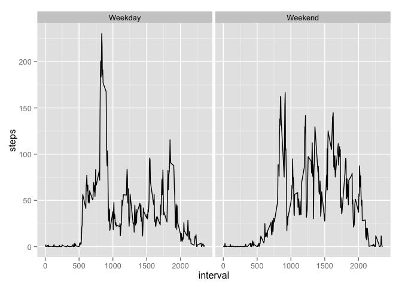

# Reproducible Research: Peer Assessment 1


## Loading and preprocessing the data

Read in activity.csv from the working directory, and define the class of each column


```r
#name the types of classes found in the file 
classes <- c(steps = "integer", date = "Date", interval = "integer")
#read in data frame with 17568 observations
activity  <- read.csv("activity.csv", colClasses = classes)
```


## What is mean total number of steps taken per day?


```r
library(reshape2)
activitymelt <- melt(activity,id = c("date", "interval"), na.rm = TRUE)
#sumbyday is the sum total of steps taken per day
sumbyday <- dcast(activitymelt, date ~ variable , sum)
```


```r
hist(sumbyday$steps/1000, xlab= "Total number of steps by day in thousands", main = NULL, breaks = 15)
```

 


```r
stepstats  <- c(mean = round(mean(sumbyday$steps),0), median = round(median(sumbyday$steps),0))

options(scipen=999) ##when printing out numbers, don't make them scientific notation
```
The mean number of steps is 10766
The median number of steps is 10765


## What is the average daily activity pattern?

```r
averageoverdays <- dcast(activitymelt, interval ~ variable, mean)

with(averageoverdays, plot(interval, steps, type = "l"))
```

 

```r
maxsteps <- round(averageoverdays[averageoverdays$steps %in% max(averageoverdays$steps),],0)
```
The time between 8:35 and 8:40 (or the interval of 835) contains the maximum average of 206 steps.

## Imputing missing values
I am going to use the average of each interval from all days (not including NA) for the steps
for that interval on each NA day.

```r
#here I am determining what dates need to be updated
missingdata <- is.na(activity$steps)
#this gives me a list of the unique dates that need to be updated
dates <- unique(activity$date[missingdata])
```

The are 8 days of missing data and there are 288 observations per day
therefore the total amount of mising data is 2304 observations 

The dates are: 2012-10-01, 2012-10-08, 2012-11-01, 2012-11-04, 2012-11-09, 2012-11-10, 2012-11-14, 2012-11-30


```r
#use the average over days data, gives the average for each interval over all the days, excluding NA data
activity[missingdata, "steps"] <- averageoverdays$steps

activitymelt2 <- melt(activity,id = c("date", "interval"), na.rm = TRUE)

#sumbyday is the sum total of steps taken per day
sumbyday2 <- dcast(activitymelt2, date ~ variable , sum)


hist(sumbyday2$steps/1000, xlab= "Total number of steps by day in thousands", main = NULL, breaks = 15)
```

 

```r
stepstats2  <- c(mean = mean(sumbyday2$steps), median = median(sumbyday2$steps))
```
The initial statistics are mean 10766 and median 10765

The final statistics, after substituting in the average values per interval are mean 10766 and median 10766

with a difference of mean 0 and median 1


## Are there differences in activity patterns between weekdays and weekends?

```r
library("ggplot2")
activity$weekday <- weekdays(activity$date)

weekend <- activity$weekday == "Saturday" | activity$weekday == "Sunday"
activity$weekday[weekend] <- "Weekend"
activity$weekday[!weekend] <- "Weekday"
activity$weekday <- as.factor(activity$weekday)

activitymelt <- melt(activity,id = c("date", "interval", "weekday"), na.rm = TRUE)
#meanbydayofweek is the sum total of steps taken per day
meanbydayofweek <- dcast(activitymelt, weekday ~ variable , mean)
head(meanbydayofweek)
```

```
##   weekday    steps
## 1 Weekday 35.61058
## 2 Weekend 42.36640
```

```r
#meanbydayofweek


qplot(interval, steps, data=activity, facets = .~weekday, rm.na = TRUE, geom = "line")
```

 
