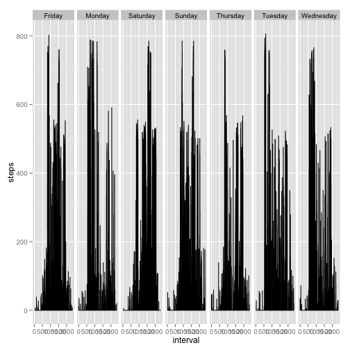
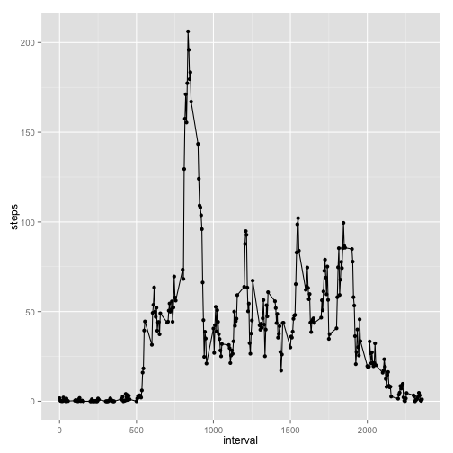

Peer Assesment 1, Repreducable Research, Coursera
========================================================


```r
classes <- c(steps = "integer", date = "Date", interval = "integer")
# read in data frame with 17568 observations
activity <- read.csv("activity.csv", colClasses = classes)
```


I don't like the way interval is defined. 


```r
for (i in 1:61) {
    for (j in 1:2) {
        activity$interval[288 * (i - 1) + j] <- paste0("000", activity$interval[288 * 
            (i - 1) + j])
        # if (j==120){print( activity$interval[288*(i-1)+j]) }
    }
    for (j in 3:12) {
        activity$interval[288 * (i - 1) + j] <- paste0("00", activity$interval[288 * 
            (i - 1) + j])
        # if (j==120){print( activity$interval[288*(i-1)+j]) }
    }
    for (j in 13:120) {
        activity$interval[288 * (i - 1) + j] <- paste0("0", activity$interval[288 * 
            (i - 1) + j])
        # if (j==120){print( activity$interval[288*(i-1)+j]) }
    }
}


interval <- strptime(paste(activity$date, activity$interval), format = "%Y-%m-%d %H%M")

activity <- cbind(activity, datetime = interval)

ni <- sub("[0-9]{4}-[0-9]{2}-[0-9]{2} ", replacement = "", interval)
activity <- cbind(activity, newinterval = ni)
```


```r
## remove rows with NA (only found in column = steps) 2304 rows removed
## resulting in a data frame of 15,264 rows
activity2 <- activity[!is.na(activity$steps), ]
```

Now I want to sum up all the the steps by date.
I will do this in a couple of different ways.
First I will use the reshape2 package


```r
library(reshape2)
activitymelt <- melt(activity, id = c("date", "interval", "datetime", "newinterval"), 
    na.rm = TRUE)
# sumbyday is the sum total of steps taken per day
sumbyday <- dcast(activitymelt, date ~ variable, sum)
# meanbyday is the mean number of steps taken each day
meanbyday <- dcast(activitymelt, date ~ variable, mean)
```

You can also embed plots, for example:


```r
hist(sumbyday$steps/1000, xlab = "Total number of steps by day by thousands", 
    main = NULL, breaks = 15)
```

 

the mean and median number of steps in a day are

```r

stepstats <- c(mean = mean(sumbyday$steps), median = median(sumbyday$steps))
stepstats
```

```
##   mean median 
##  10766  10765
```


```r
averageoverdays <- dcast(activitymelt, interval ~ variable, mean)
averageoverdaysnew <- dcast(activitymelt, datetime ~ variable, mean)

averageoverdays[averageoverdays$steps %in% max(averageoverdays$steps), ]
```

```
##     interval steps
## 104     0835 206.2
```

```r

with(averageoverdays, plot(interval, steps, type = "l"))
```

 

```r
with(averageoverdaysnew, plot(datetime, steps, type = "l"))
```

 


impute missing days
I am going to average the number of steps from that interval of the surrounding days
There are 8 days of missing data 288 observation/day *8 = 2304
The dates are 
- 2012-10-01
- 2012-10-08
- 2012-11-01
- 2012-11-04
- 2012-11-09
- 2012-11-10
- 2012-11-14
- 2012-11-30


dates  <- is.na(castedna$steps)
dates <- castedna$date[dates]
names(dates) <- dates
dates <- as.list(dates)
activity$steps[activity$date==dates[1]
meandates <- dates+1
times  <- activity$interval[1:288]
activity$steps[activity$date==dates[1] & activity$interval==times[1]]
       <- 
